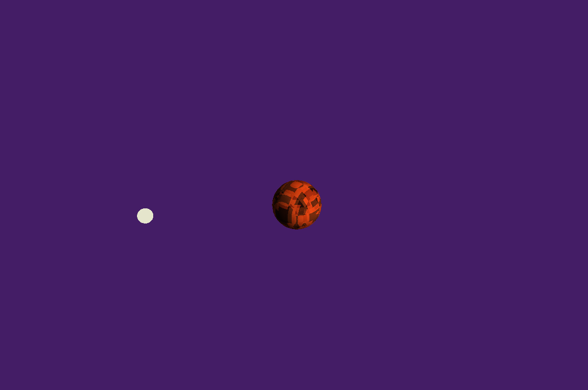
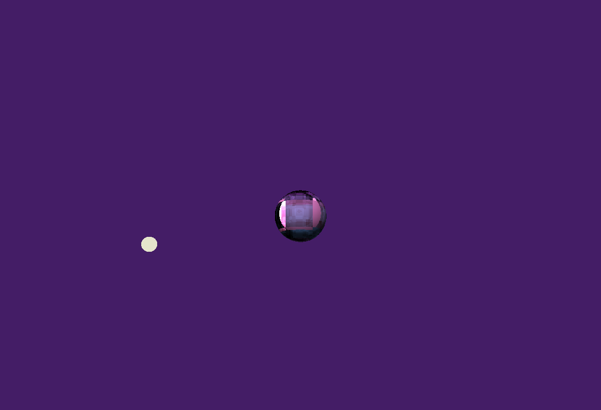
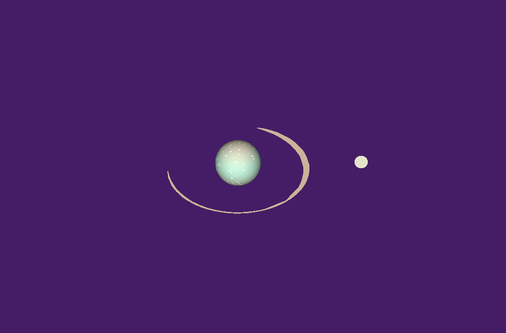

# GPC-Lab4-Shaders
# Planet Shaders

Un proyecto de visualización de planetas con diferentes shaders implementados en Rust usando Raylib.

## Características

- 5 tipos diferentes de planetas con shaders únicos:
  - **Planeta rocoso**: Planeta con patrones de lava (rojos y naranjas)
  - **Gigante gaseoso**: Planeta con patrones de nebulosa (púrpuras y azules)
  - **Planeta arcoiris**: Planeta con colores cíclicos en movimiento
  - **Planeta glitter**: Planeta girly con destellos y colores pastel
  - **Planeta corazón**: Planeta con forma de corazón y patrones femeninos

## Instalación

1. Clona el repositorio:
```bash
git clone <https://github.com/AleWWH1104/GPC-Lab4-Shaders.git>
cd <GPC-Lab4-Shaders/Lab4_Shaders>
```

2. Ejecuta el proyecto:
```bash
cargo run
```


## Estructura del proyecto

- `main.rs`: Punto de entrada principal y bucle de renderizado
- `shaders.rs`: Implementación de los diferentes shaders para cada tipo de planeta
- `models/sphere.obj`: Modelo 3D esférico usado para todos los planetas

## Imágenes







## Controles

- `WASD`: Mover la cámara
- `Mouse`: Mirar alrededor
- `Rueda del mouse`: Acercar/Alejar
- `1-5`: Cambiar tipo de planeta

## Tecnologías utilizadas

- [Rust](https://www.rust-lang.org/)
- [Raylib-rs](https://github.com/deltaphc/raylib-rs) - Binding de Raylib para Rust
- [OBJ loader](https://docs.rs/tobj/) - Para cargar modelos 3D

